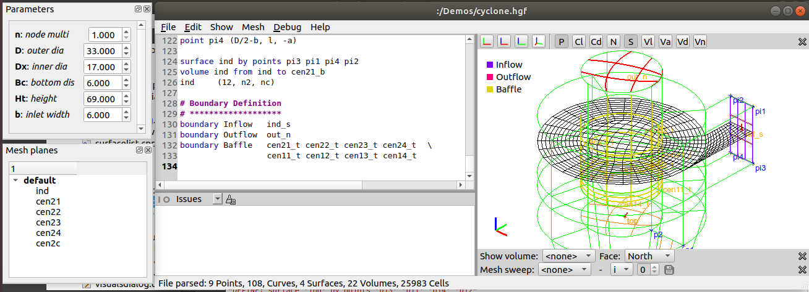

##HexGrid
*HexGrid* is a program designed to create multi block meshes primary for CFD programs (and optionally for FE programs). *HexGrid* exports the mesh in a *CGNS* file.
*HexGrid* is a *procedural* and *parametric* grid generator i.e. you write a program describing how to generate the grid. The program allows the definition of modifiable parameters for subsequent parametric studies.

*HexGrid* is developed on Ubuntu 18.04 LTS. For now this GitHub only contains Windows binary in the 'windows' sub-directory.

The screenshot above shows the main window of *HexGrid* when the *cyclone* demo has been loaded. The main window has a left- and a right part.
The right part shows the points, curves, volumes and mesh planes in 3d. The upper band of icons are used for turning display of identities on and off. Below the 3d graphics - when shown - are panes for displaying volume faces and meshes.
The left part contains the *HexGrid* input file - the '*.hgf' file - and below a window for displaying errors and messages.

For now *HexGrid* contains a rudimentary help function (F1) showing the syntax of the different commands. Inspiration can be found in the demos under 'File' menu.
<!-- [User Guide](indeks.md) -->